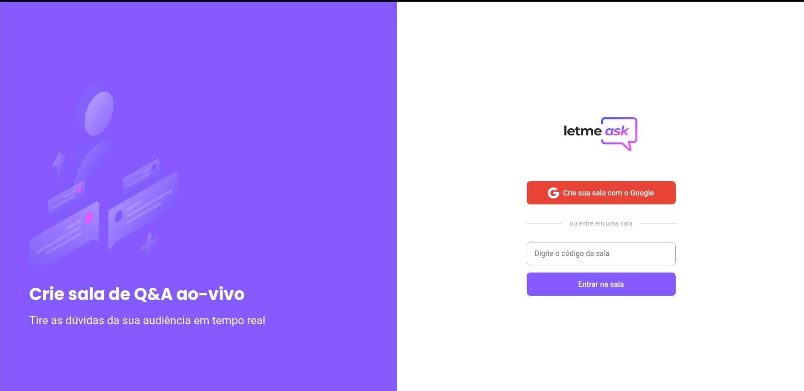

# 
 NLW/Together Rocketseat :rocket: 

# 
 Letmeask App :woman_dancing:

    Next Level Week - Mission: ReactJS! 
    

  

### Sobre o Projeto Letmeask :technologist: 
Projeto de um app desenvolvido durante a Next Level Week da Rocketseat durante a semana 20 e 27 de junho de 2021. 

### Tecnologias Front-end utilizadas :hammer_and_wrench: 
* ReactJS
* Typescript
* Firebase Authentication
* Firebase Realtime Database

### Requerimentos :pencil:

* Node.js
* Yarn 

Acesse o projeto:  [Letmeask](https://letmeask-aulas-d09b5.web.app/) 

Projeto feito com 💙 por Joseane Guedes e Rocketseat 🚀

<!-- ## Programação

* Dia 1: Cadastro de usuário 
* Dia 2: Criação de Salas
* Dia 3: Envio de Perguntas em tempo real
* Dia 4:Curtir perguntas
* Dia 5: Excluir salas -->

<!-- [Configuração do ambiente](https://www.notion.so/Configura-es-do-ambiente-84c104da38fe4f51a31c1e2c757250fb) 

[Cronograma](https://nextlevelweek.com/cronograma/6) :hourglass:

[Aulas](https://nextlevelweek.com/episodios/react/aula-1/edicao/6) :open_book: -->

